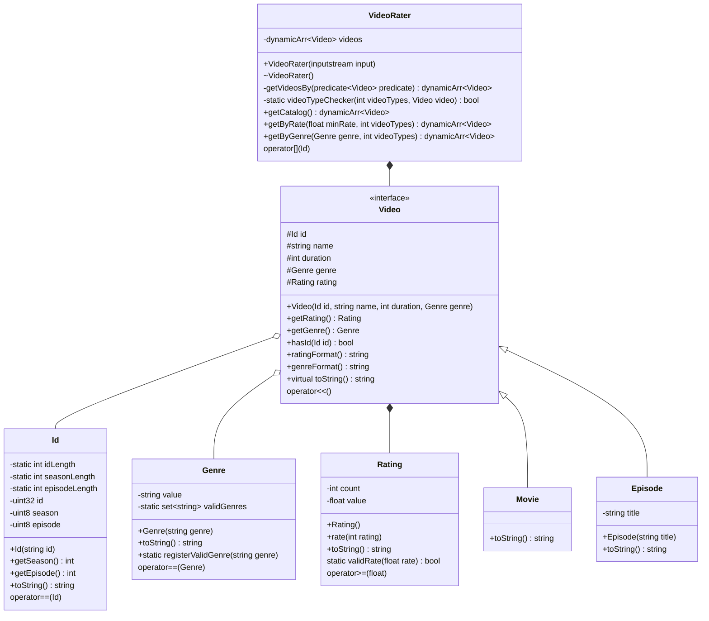

```mermaid
classDiagram
    class Id{
        -static int idLength
        -static int seasonLength
        -static int episodeLength
        -uint32 id
        -uint8 season
        -uint8 episode
        +Id(string id)
        +getSeason() int
        +getEpisode() int
        +toString() string
        operator==(Id)
    }
    class Genre{
        -string value
        -static set~string~ validGenres
        +Genre(string genre)
        +toString() string
        +static registerValidGenre(string genre)
        operator==(Genre)
    }
    class Rating{
        -int count
        -float value
        +Rating()
        +rate(int rating)
        +toString() string
        static validRate(float rate) bool
        operator>=(float)
    }
    class Video {
        <<interface>>
        #Id id
        #string name
        #int duration
        #Genre genre
        #Rating rating
        +Video(Id id, string name, int duration, Genre genre)
        +getRating() Rating
        +getGenre() Genre
        +hasId(Id id) bool
        +ratingFormat() string
        +genreFormat() string
        +virtual toString() string
        operator<<()
    }
    class Movie{
        +toString() string
    }
    class Episode {
        -string title
        +Episode(string title)
        +toString() string
    }
    class VideoRater{
        -dynamicArr~Video~ videos
        +VideoRater(inputstream input)
        ~VideoRater()
        -getVideosBy(predicate~Video~ predicate) dynamicArr~Video~
        -static videoTypeChecker(int videoTypes, Video video) bool
        +getCatalog() dynamicArr~Video~
        +getByRate(float minRate, int videoTypes) dynamicArr~Video~
        +getByGenre(Genre genre, int videoTypes) dynamicArr~Video~
        operator[](Id)
    }

    Video o-- Id
    Video o-- Genre
    Video *-- Rating
    Video <|-- Movie
    Video <|-- Episode
    VideoRater *-- Video
```