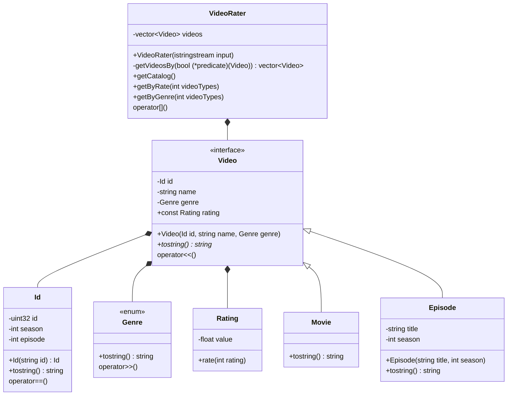

```mermaid
classDiagram
    class Id{
        -uint32 id
        -int season
        -int episode
        +Id(string id) Id
        +tostring() string
        operator==()
    }
    class Genre{
        <<enum>>
        +tostring() string
        operator>>()
    }
    class Rating{
        -float value
        +rate(int rating)
    }
    class Video {
        <<interface>>
        -Id id
        -string name
        -Genre genre
        +const Rating rating
        +Video(Id id, string name, Genre genre)
        +tostring()* string
        operator<<()
    }
    class Movie{
        +tostring() string
    }
    class Episode {
        -string title
        -int season
        +Episode(string title, int season)
        +tostring() string
    }
    class VideoRater{
        -vector~Video~ videos
        +VideoRater(istringstream input)
        -getVideosBy(bool (*predicate)(Video)) vector~Video~
        +getCatalog()
        +getByRate(int videoTypes)
        +getByGenre(int videoTypes)
        operator[]()
    }

    Video *-- Id
    Video *-- Genre
    Video *-- Rating
    Video <|-- Movie
    Video <|-- Episode
    VideoRater *-- Video
```