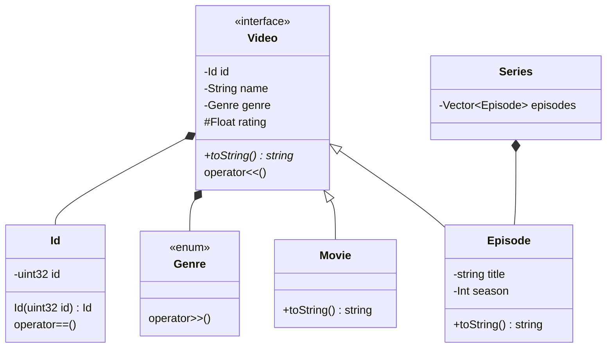

```mermaid
classDiagram
    class Id{
        -uint32 id
        Id(uint32 id) Id
        operator==()
    }
    class Genre{
        <<enum>>
        operator>>()
    }
    class Video {
        <<interface>>
        -Id id
        -String name
        -Genre genre
        #Float rating
        +toString()* string
        operator<<()
    }
    class Movie{
        +toString() string
    }
    class Series{
        -Vector~Episode~ episodes
    }
    class Episode {
        -string title
        -Int season
        +toString() string
    }
    Video *-- Id
    Video *-- Genre
    Video <|-- Movie
    Video <|-- Episode
    Series *-- Episode
```