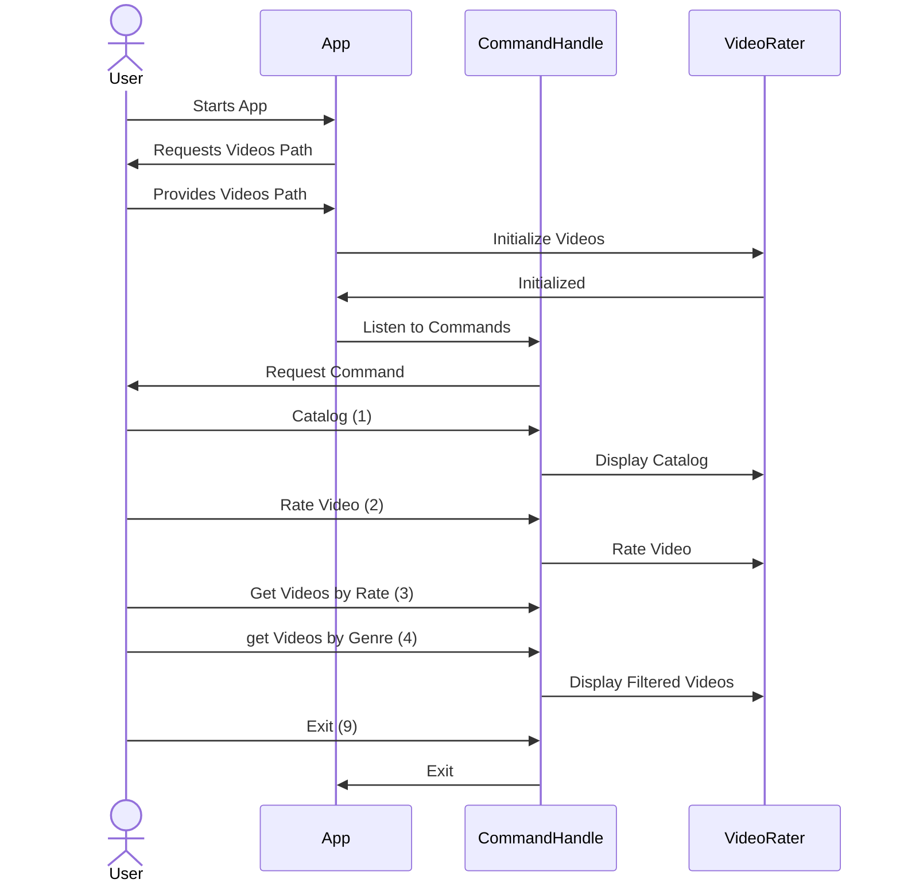

```mermaid
sequenceDiagram
    actor User
    participant App
    participant CommandHandle
    participant VideoRater

    User ->> App: Starts App
    App ->> User: Requests Videos Path
    User ->> App: Provides Videos Path
    App ->> VideoRater: Initialize Videos
    VideoRater ->> App: Initialized
    App ->> CommandHandle: Listen to Commands
    CommandHandle ->> User: Request Command
    User ->> CommandHandle: Catalog (1)
    CommandHandle ->> VideoRater: Display Catalog
    User ->> CommandHandle: Rate Video (2)
    CommandHandle ->> VideoRater: Rate Video
    User ->> CommandHandle: Get Videos by Rate (3)
    User ->> CommandHandle: get Videos by Genre (4)
    CommandHandle ->> VideoRater: Display Filtered Videos
    User ->> CommandHandle: Exit (9)
    CommandHandle ->> App: Exit

```